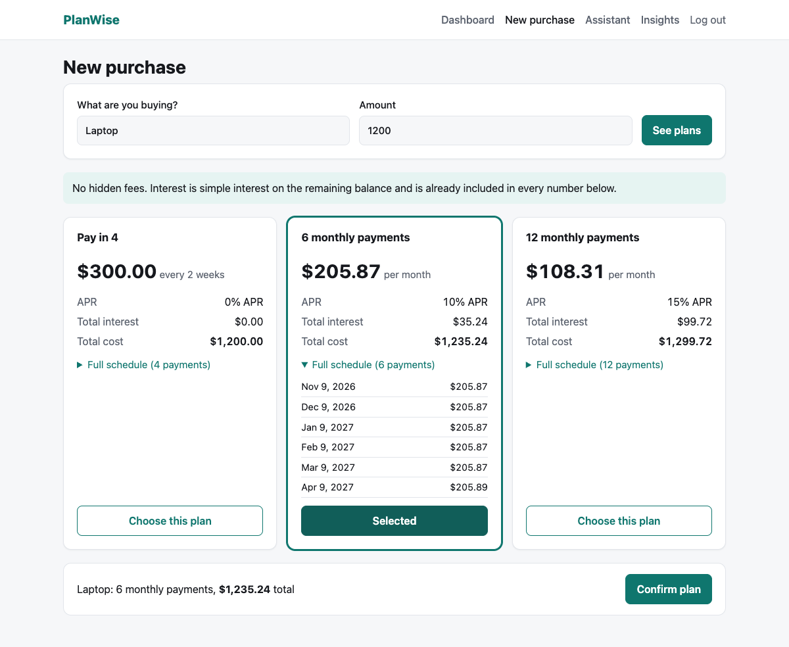
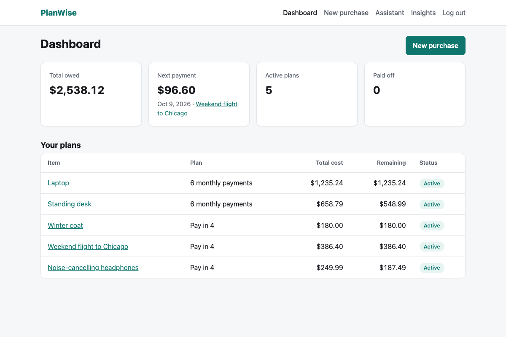
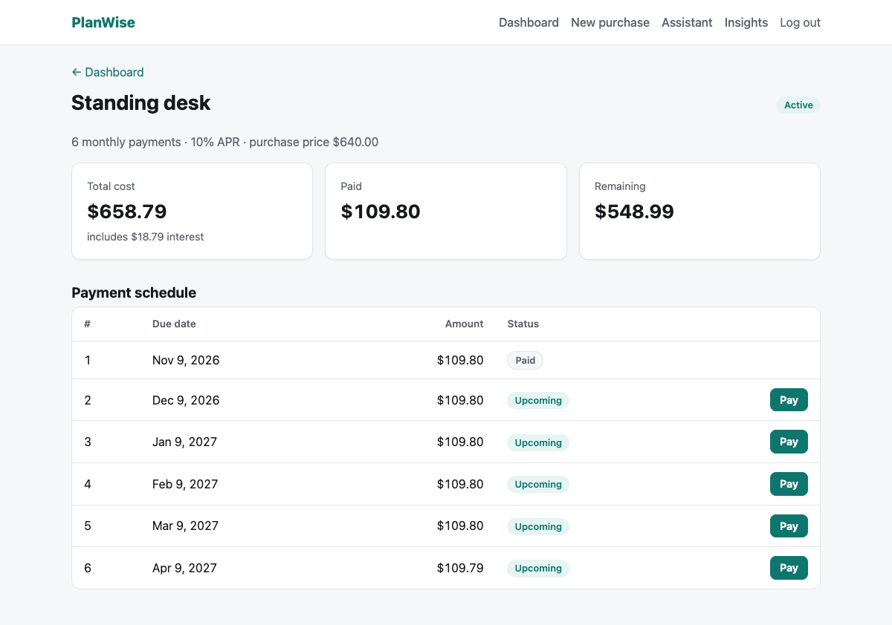
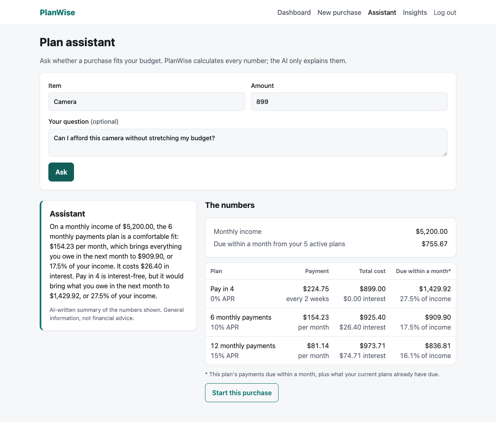
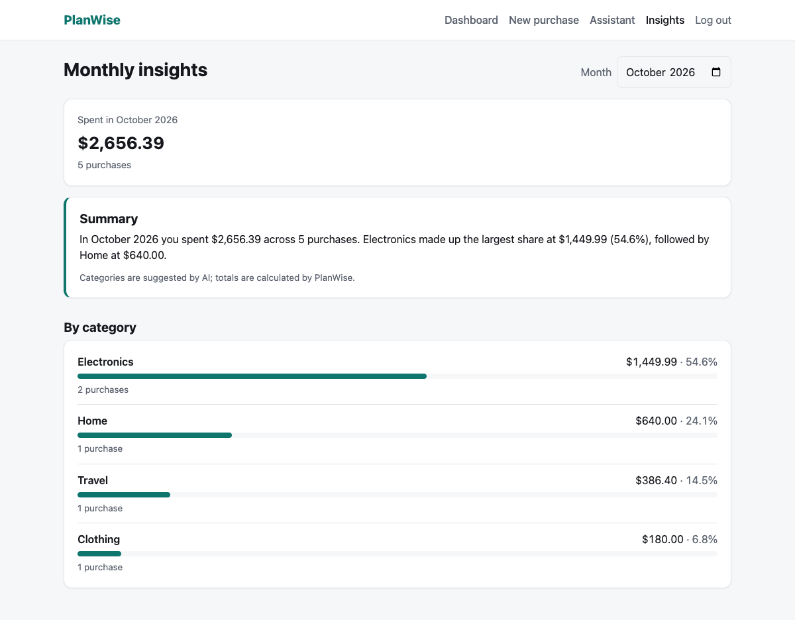
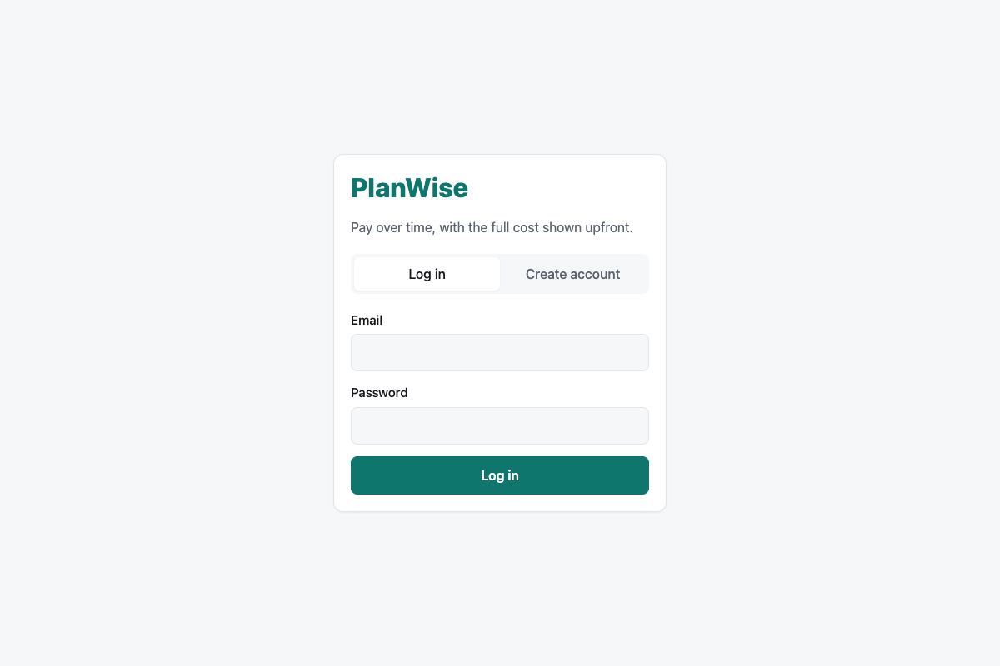
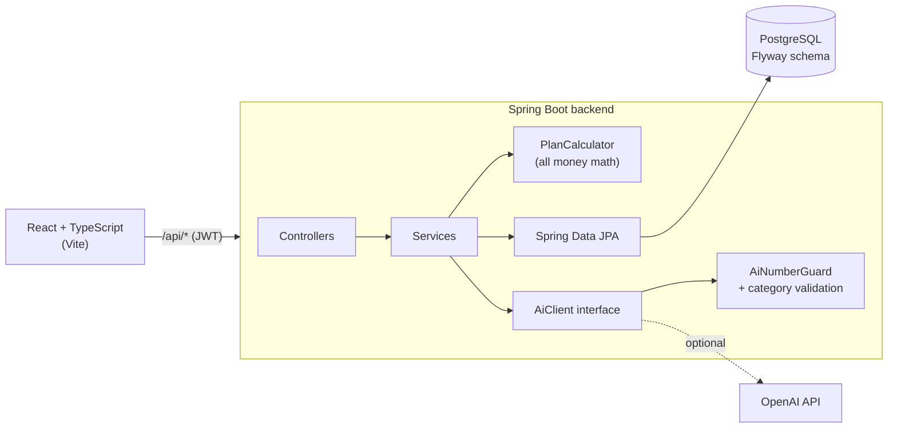

# PlanWise

[](https://github.com/StaceyA132/PlanWise/actions/workflows/ci.yml)

A pay-over-time web app in the style of Affirm, built around one idea: **show the full cost upfront.** Enter a purchase, compare installment plans side by side with every payment, due date, and dollar of interest visible, pick one, and track it until it's paid off. An AI assistant explains whether a plan fits your budget, but **the AI never does the math.** Java calculates every number, and the AI is only allowed to explain them.

**Stack:** Java 21 · Spring Boot 3 · Spring Security (JWT) · PostgreSQL · Flyway · React · TypeScript · Vite · OpenAI API · JUnit 5 · Mockito · Testcontainers · GitHub Actions

---

## Screenshots

| Compare plans before you commit | Dashboard |
|---|---|
|  |  |
| **Plan detail: pay installments** | **AI assistant next to the real numbers** |
|  |  |
| **Monthly insights** | **Login** |
|  |  |

---

## Features

- **Honest plan quotes.** Every purchase gets three options, each showing the payment, full schedule with due dates, total interest, and total cost:
  - **Pay in 4:** 4 payments every 14 days, 0% APR, first payment today
  - **6 monthly payments** at 10% APR
  - **12 monthly payments** at 15% APR
- **Track and pay.** Pay installments one at a time; a plan becomes *Paid off* when the last one is paid. Overdue payments show as *Late*.
- **Dashboard.** Total owed, the next payment due, and counts of active and paid-off plans.
- **AI plan assistant.** Ask "can I afford this?" and get a plain-English answer that uses only numbers PlanWise calculated, shown next to the full plan table.
- **AI monthly insights.** Purchases are sorted into Electronics, Clothing, Home, Travel, or Other; Java totals each category and the AI writes a 2–3 sentence summary.
- **Works without AI.** If the AI is down, slow, or not configured, every page still shows the complete numbers, just without the explanation.

---

## Why the AI never does the math

Language models are good at explaining and bad at arithmetic: they can round, mix up numbers, or invent a plausible-looking total. In a money app, a wrong number is a serious bug. So PlanWise splits the work:

| Java (deterministic, tested) | AI (language only) |
|---|---|
| Plan schedules, interest, totals | Explains which plan fits and why |
| Existing payments due this month | Writes the monthly summary |
| Each plan's share of monthly income | Suggests a category for each purchase |
| Category totals and percentages | |

This is enforced in code, not just requested in the prompt:

1. **Only pre-calculated facts go to the AI.** The backend formats every number (for example `"$1,235.24"`, `"17.5%"`) and sends only those. The prompt tells the model to copy them exactly and never calculate.
2. **Every reply is checked.** `AiNumberGuard` scans the AI's text for dollar amounts and percentages. If any number isn't one PlanWise provided (say the model subtracts two totals and writes "saving you $64.48"), the whole reply is discarded.
3. **Structured output is validated.** For categories, the AI must return JSON. Each answer must reference a purchase id that was sent and a category from the fixed list; anything else ("Gadgets", an unknown id, malformed JSON) is rejected and the purchase is shown as *Uncategorized*.
4. **Failures degrade gracefully.** A timeout, error, missing API key, or rejected reply returns the real numbers without an explanation. The AI is never on the critical path.
5. **No personal data.** Emails, password hashes, and user ids are never sent to the AI. Tests capture the exact prompt and assert this.
6. **Mockable by design.** All AI calls go through an `AiClient` interface, so tests replace it with a Mockito mock and CI never needs an API key.

---

## Architecture



**Backend** (`backend/src/main/java/com/planwise/`)

| Package | Responsibility |
|---|---|
| `plan` | `PlanCalculator`, plan/payment entities, create/list/pay endpoints |
| `quote` | `POST /api/quotes`: plan options without saving anything |
| `dashboard` | Totals and next payment for the logged-in user |
| `auth`, `config` | Register/login, BCrypt password hashing, JWT signing and verification |
| `assistant` | Budget facts, prompt building, and the plan assistant endpoint |
| `insights` | Categorization, category totals, and the monthly summary |
| `ai` | `AiClient` interface, OpenAI implementation, `AiNumberGuard` |
| `web` | One exception handler that turns errors into consistent JSON responses |

**Frontend** (`frontend/src/`): pages for login, dashboard, new purchase, plan detail, assistant, and insights. All HTTP goes through one `api.ts` wrapper that attaches the token and surfaces the backend's error messages. The frontend only formats money for display; it never calculates it.

### Money rules

- Money is `BigDecimal` in Java and `NUMERIC(12,2)` in PostgreSQL. Never `double` or `float`.
- Amounts are rounded to cents with `HALF_UP`. The last payment absorbs any rounding difference, so **a plan's payments always add up exactly to its total cost.** A parameterized test checks this across amounts from $0.01 to $10,000.
- Monthly plans use standard amortization, `payment = P·r / (1 − (1 + r)^−n)` with `r = APR / 12`, and simple interest on the remaining balance (no compounding).
- Amounts of $0 or less, over $10,000, or with fractions of a cent are rejected. The database enforces the same limit with a `CHECK` constraint.

### Design decisions

- **The server recalculates every plan.** When a user picks a plan, the client sends only the item, amount, and number of payments. Payment amounts are never accepted from the client.
- **Users can only see their own data.** Every query filters by the user id from the verified JWT. Another user's plan returns 404, the same as one that doesn't exist.
- **Paying is safe under concurrency.** Paying an installment locks the plan row (`SELECT … FOR UPDATE`), so two simultaneous payments can't leave a fully paid plan marked active.
- **No N+1 queries.** Plan lists load purchases and payments in a single query with `@EntityGraph`.
- **"Late" is derived, not stored.** An unpaid payment past its due date is reported as late at read time, so there's no background job to keep in sync.
- **Login doesn't leak which emails exist.** Unknown email and wrong password return the same message and take the same time.
- **Time is injectable.** Services read the date from a `Clock` bean, so tests can move time forward to make payments overdue.
- **No database connection is held during AI calls.** The assistant and insights services aren't transactional; each query runs its own short transaction.

---

## Running locally

**Prerequisites:** Java 21+, Node.js 20.19+ or 22.12+, Docker Desktop.

```bash
# 1. Start PostgreSQL (runs on port 5433)
docker compose up -d

# 2. Start the backend on http://localhost:8080
cd backend
./mvnw spring-boot:run

# 3. In a second terminal, start the frontend on http://localhost:5173
cd frontend
npm install
npm run dev
```

Open **http://localhost:5173** and create an account. The Vite dev server proxies `/api` to the backend, so no CORS setup is needed.

To stop: `Ctrl+C` in both terminals, then `docker compose down` (your data is kept in a Docker volume).

### Configuration

All settings have local defaults; override them with environment variables.

| Variable | Purpose | Default |
|---|---|---|
| `OPENAI_API_KEY` | Enables the AI assistant and insights | *(unset: the app runs without AI text)* |
| `OPENAI_MODEL` | OpenAI model to use | `gpt-5-mini` |
| `JWT_SECRET` | Token signing secret, at least 32 characters | *(unset: a random secret per startup, so logins reset on restart)* |
| `DB_URL`, `DB_USERNAME`, `DB_PASSWORD` | PostgreSQL connection | Matches `docker-compose.yml` |

Secrets are only ever read from the environment; none are committed.

---

## API

All endpoints except register, login, and quotes require `Authorization: Bearer <token>`. Errors use the standard [Problem Details](https://www.rfc-editor.org/rfc/rfc9457) format: `{"status": 400, "detail": "Amount must be $10,000 or less"}`.

| Method | Endpoint | Description |
|---|---|---|
| `POST` | `/api/auth/register` | Create an account (email, password, optional monthly income) and get a token |
| `POST` | `/api/auth/login` | Get a token |
| `GET` | `/api/me` | The logged-in user's profile |
| `POST` | `/api/quotes` | Plan options for an amount; saves nothing |
| `POST` | `/api/plans` | Create a purchase, plan, and payment schedule |
| `GET` | `/api/plans` | Your plans, newest first |
| `GET` | `/api/plans/{id}` | One plan with its schedule |
| `POST` | `/api/payments/{id}/pay` | Pay an installment; returns the updated plan |
| `GET` | `/api/dashboard` | Total owed, next payment, active and paid-off counts |
| `POST` | `/api/assistant/ask` | Plan options, budget facts, and an AI explanation |
| `GET` | `/api/insights/monthly?month=YYYY-MM` | Category totals and an AI summary for a month |

---

## Testing

```bash
cd backend && ./mvnw test        # 84 tests; Docker must be running for Testcontainers
cd frontend && npm run build     # type-check and build
```

| Kind | What it covers |
|---|---|
| **Unit (JUnit 5)** | `PlanCalculator`: 0% and APR plans, exact amortization values, rounding so payments sum to the total, due dates, invalid amounts |
| **Unit (Mockito)** | Assistant and insights services with a mocked `AiClient`: fallbacks when the AI fails, rejected categories and ids, malformed JSON, discarded replies containing invented numbers, and prompts that contain no personal data |
| **HTTP client** | `OpenAiClient` against Spring's `MockRestServiceServer`: request format, JSON mode, error handling |
| **Web layer** | `@WebMvcTest` for quotes: validation and error responses |
| **Integration (Testcontainers)** | Full app against a real PostgreSQL: register and login, create a plan, pay every installment until it's paid off, dashboard totals, late payments, user isolation, insights, and the schema's constraints |

**CI:** GitHub Actions runs the backend tests and the frontend lint, type-check, and build on every push and pull request.

---

## Possible next steps

- Deploy the backend and database (e.g. Render or Railway) and the frontend (e.g. Vercel) for a public demo
- Let users update their monthly income after sign-up (`PATCH /api/me`)
- Move the token from `localStorage` to an httpOnly cookie to reduce exposure to XSS
- Rate-limit the AI endpoints and cache insights per month
